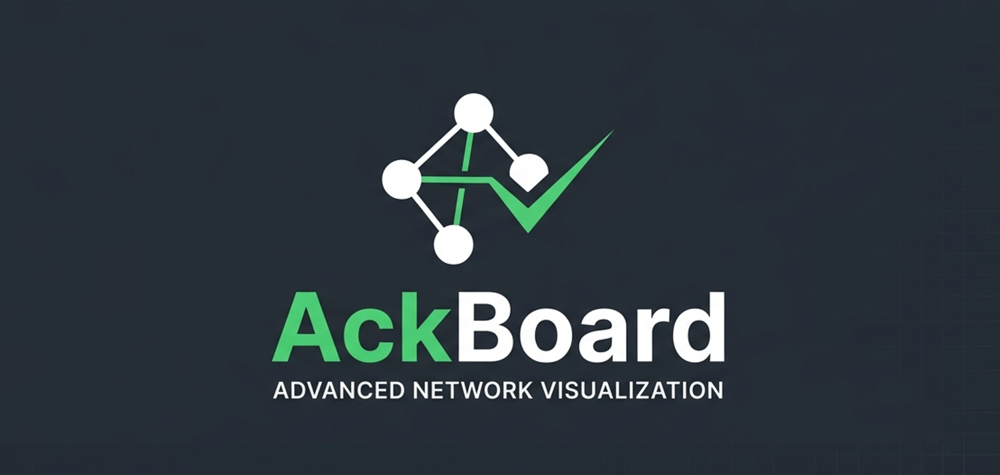
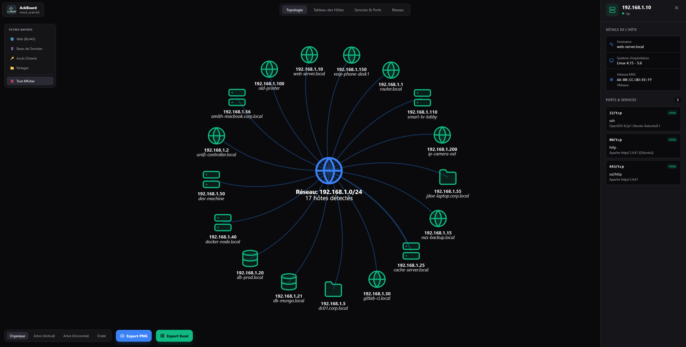
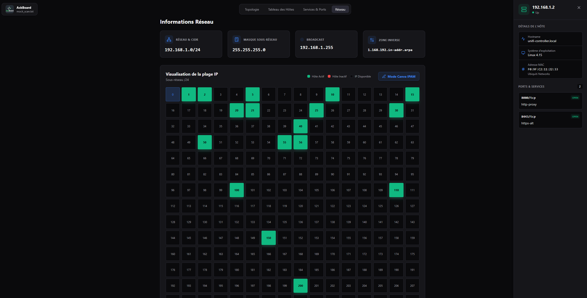
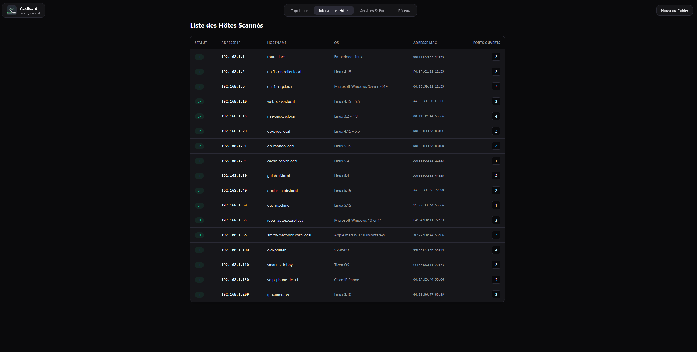
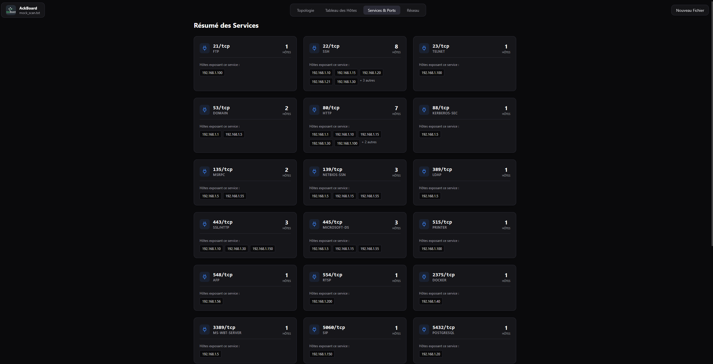

  
    
  
  
  
   
  <h1>🌐 AckBoard</h1>
  
<b>Visualiseur Avancé de Topologie Nmap & Tableau de Bord de Surface d'Attaque</b>

  
<i>Advanced Nmap Topology Visualizer & Attack Surface Dashboard</i>

---

## 📸 Aperçu de l'Interface / Screenshots

### Vue Topologique & Filtres

### Gestion du Réseau & IPAM (Canvas)

### Tableau de Bord des Hôtes & Services

---

## 🇫🇷 Version Française

### 📖 Présentation
**AckBoard** est un outil de visualisation réseau ultra-rapide, 100% côté client et sans serveur, conçu pour les ingénieurs réseau, les pentesters et les administrateurs système. 

Il prend les **sorties de scan Nmap** standards (`.txt` ou `.xml`) et les transforme instantanément en topologies réseau interactives, dynamiques et hautement lisibles — sans jamais envoyer vos données d'infrastructure sensibles sur le réseau. Tout s'exécute de manière sécurisée directement dans votre navigateur grâce aux API Web modernes.

### ✨ Fonctionnalités Principales

- 🔒 **100% Hors-ligne & Côté Client** : Pas de backend, pas de Node.js, aucune requête API. Vos données de scan ne quittent jamais votre machine.
- 🕸️ **Topologie Interactive** : Un graphe réseau interactif basé sur la physique, propulsé par `vis-network`.
- 🎨 **Auto-Classification Intelligente** : Des icônes SVG dynamiques sont automatiquement attribuées aux appareils en fonction de leurs ports ouverts.
- 🔍 **Filtres de Surface d'Attaque** : Isolez instantanément les cibles de grande valeur en un clic (Serveurs Web, Accès Distant, Bases de données).
- 📊 **Tableau de Bord Complet** : Vue Topologique, Tableau détaillé des Hôtes, résumé des Services & Ports, et gestion IPAM via Canvas.
- 📸 **Intégration aux Rapports** : Exportez votre graphe en PNG haute qualité ou exportez les données sur Excel.

### 🚀 Démarrage Rapide

AckBoard ne nécessite **aucune installation** ni compilation.

1. **Clonez ou téléchargez** ce dépôt.
2. Ouvrez le dossier et double-cliquez sur `index.html` pour l'ouvrir dans votre navigateur.
3. **Glissez-déposez** votre résultat de scan Nmap (`mock_scan.txt` fourni pour tester) dans la zone de dépôt.
4. Explorez votre réseau !

---

## 🇬🇧 English Version

### 📖 Overview
**AckBoard** is a lightning-fast, 100% client-side, zero-server network visualization tool designed for Network Engineers, Pentesters, and System Administrators. 

It takes standard **Nmap scan outputs** (`.txt` or `.xml`) and instantly transforms them into interactive, dynamic, and highly readable network topologies—without ever sending your sensitive infrastructure data over the network. Everything runs securely within your browser using modern Web APIs.

### ✨ Key Features

- 🔒 **100% Offline & Client-Side**: No backend, no Node.js, no API calls. Your scan data never leaves your machine.
- 🕸️ **Interactive Topology**: A physics-based, interactive network graph powered by `vis-network`.
- 🎨 **Smart Auto-Classification**: Devices are automatically assigned dynamic SVG icons based on their open ports.
- 🔍 **Attack Surface Filters**: Instantly isolate high-value targets with one-click "Quick Filters" (Web, Remote Access, DBs).
- 📊 **Comprehensive Dashboard**: Switch seamlessly between the Topology View, Hosts Table, Services summary, and IPAM Canvas.
- 📸 **Report Integration**: Export your current network graph as a high-quality PNG or export data to Excel.

### 🚀 Quick Start

AckBoard requires **zero installation** or compilation.

1. **Clone or download** this repository.
2. Open the folder and double-click on `index.html` to open it in your browser.
3. **Drag and drop** your Nmap scan result (`mock_scan.txt` provided for testing) into the dropzone.
4. Explore your network!

---

## 🛠️ Tech Stack

AckBoard was built with a strict "Vanilla-first" philosophy to ensure maximum portability and zero setup overhead.

- **Frontend Logic**: Vanilla JavaScript (ES6+), DOMParser, HTML5 FileReader API
- **Styling**: Tailwind CSS (via CDN) for a sleek, modern "Dark NOC" aesthetic
- **Graph Engine**: Vis-Network
- **Icons**: Lucide Icons & Custom inline SVGs

## 💡 Use Cases
- **Penetration Testing**: Quickly visualize the footprint of a target network and identify vulnerable services.
- **IT Audits**: Generate clean network maps for compliance reports or infrastructure reviews.
- **CTF / Homelab**: Visually map out your HackTheBox networks or home lab subnets.

## 📝 License
This project is licensed under the MIT License. Feel free to use, modify, and distribute as you see fit.

---
*Crafted with precision for cybersecurity professionals.*
